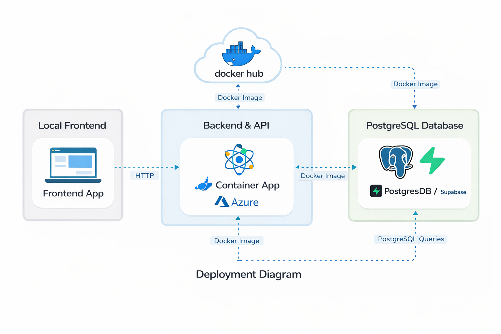

# Despliegue

## Arquitectura de despliegue
La arquitectura actual de despliegue se compone de:
- Frontend ejecutado en entorno local de desarrollo.
- Backend contenerizado con Docker.
- Imagen del backend publicada en Docker Hub.
- Azure Container Apps consumiendo esa imagen desde Docker Hub.
- Base de datos PostgreSQL gestionada en Supabase.

Flujo principal:
Frontend local -> API backend en Azure Container Apps -> PostgreSQL en Supabase.

### Diagrama de arquitectura de despliegue

	

Fuente: diagrama elaborado por el equipo del proyecto.

## Flujo operativo
1. Se construye la imagen Docker del backend.
2. Se publica la imagen en una cuenta de Docker Hub.
3. Azure Container Apps se configura para usar esa imagen como origen.
4. En Azure se definen variables de entorno para la configuración del backend.
5. El backend desplegado se conecta a Supabase usando credenciales y URL de PostgreSQL.
6. El frontend local consume el endpoint público del backend desplegado.

## Build y empaquetado
- Build tool: Maven
- Runtime: Java 17
- Packaging: Spring Boot executable jar

## Containerización
El backend usa un build Docker multi-stage:
1. Etapa de build Maven (`mvn clean package -DskipTests`)
2. Etapa de runtime JRE exponiendo puerto `8080`

## Configuración de runtime
La configuración de runtime se provee por variables de entorno en Azure Container Apps.

Variables configuradas en Azure para la conexión a base de datos y JPA:
- `SPRING_DATASOURCE_URL` (host/puerto/database de Supabase)
- `SPRING_DATASOURCE_USERNAME`
- `SPRING_DATASOURCE_PASSWORD`
- `SPRING_DATASOURCE_DRIVER_CLASS_NAME`
- `SPRING_JPA_DATABASE_PLATFORM`
- `SPRING_JPA_HIBERNATE_DDL_AUTO`

Nota: estas variables se crean en la configuración de la app en Azure (secrets/env vars) y no deben hardcodearse en el código.

## Health checks
`GET /health` está disponible para sondas de salud de la plataforma.

## Estado de CI/CD
El workflow actual de CI incluye:
- Maven build and tests
- test report artifact upload
- SonarCloud analysis

## Estado actual del frontend
El frontend existe y funciona en local, consumiendo el backend desplegado en Azure mediante URL pública de la API.

Esto permite validar el flujo completo de negocio aunque el frontend aún no esté desplegado en nube.
