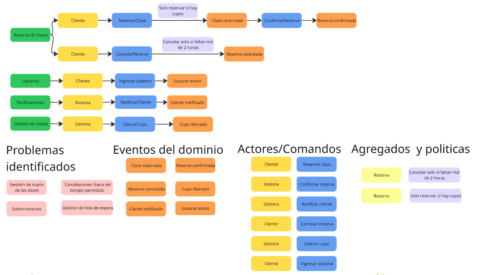
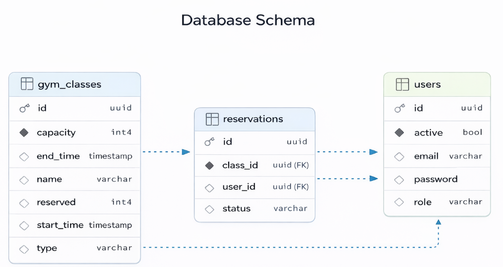

# Modelo de Dominio (DDD)

El modelo de dominio sigue principios de Domain-Driven Design (DDD), donde las reglas de negocio se encapsulan en entidades, agregados y value objects, manteniendo la lógica independiente de detalles técnicos.

## Entidades principales
### Reservation
- Vincula `UserId` con `ClassId`.
- Estado de ciclo de vida: `ACTIVE` o `CANCELLED`.

### GymClass
- Mantiene metadatos de clase (nombre, `ClassType`, `TimeSlot`, capacidad).
- Mantiene el conteo de cupos reservados.
- Expone comportamiento de dominio para reservar y liberar cupos.

### User
- Representa usuarios de la plataforma con rol y estado activo.
- Usa `Email` y `Password` como value objects.

## Agregados
El agregado principal es **Reservation**, que actúa como raíz de agregado y garantiza la consistencia de reglas de negocio relacionadas con la reserva.

Las operaciones sobre reservas (crear, cancelar) se ejecutan a través de casos de uso y entidades de dominio, aplicando invariantes antes de persistir.

`GymClass` actúa como agregado colaborador para mantener la consistencia de cupos (reservar/liberar).

## Bounded Context
El sistema se centra en el contexto de **gestión de reservas**, e interactúa con contextos cercanos como usuarios, clases y notificaciones.

El contexto de usuarios está desacoplado y simplificado para mantener independencia del dominio principal de reservas.

## Value Objects
- IDs: `UserId`, `ReservationId`, `ClassId`.
- Scheduling: `TimeSlot`.
- Constraints: `Cupo` (capacity).
- User identity fields: `Email`, `Password`.

## Eventos de Dominio
Eventos definidos en el dominio:
- `ReservationCreatedEvent`
- `ReservationCancelledEvent`
- `ClassCreatedEvent`
- `ClassFullEvent`
- `UserDeactivatedEvent`

Nota: la liberación de cupo existe como comportamiento de dominio al cancelar una reserva, pero no está modelada como un evento separado `SpotReleased` en la implementación actual.

## Invariantes del Dominio
- Un usuario solo puede tener una reserva activa por clase.
- No se permite crear reservas si no hay cupos disponibles.
- Solo usuarios activos pueden realizar reservas.
- La cancelación de una reserva libera automáticamente un cupo.

El estado del usuario se valida como una precondición externa al dominio de reservas (a través de repositorios y casos de uso).

## Flujo de validación de reserva

Fuente: diagrama elaborado por el equipo del proyecto.

## Esquema de base de datos

	

Fuente: diagrama elaborado por el equipo del proyecto.

Nota: las relaciones se presentan a nivel lógico. En la implementación JPA actual, las asociaciones se manejan mediante IDs UUID (`userId`, `classId`) en `reservations`.

## Restricciones de tipo de clase
Los valores aceptados son:
- `YOGA`
- `CROSSFIT`
- `CARDIO`
- `WEIGHTS`
- `FUNCTIONAL`
