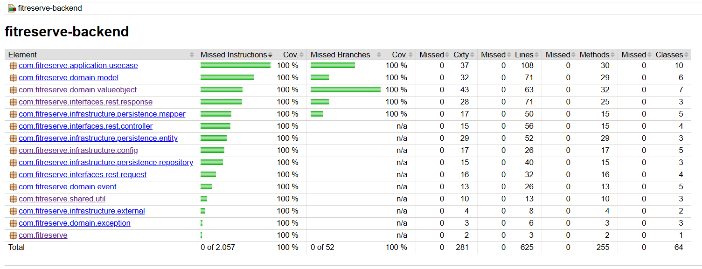

# Estrategia de Testing

## Alcance

Las pruebas cubren todas las capas de la arquitectura: dominio, aplicación, infraestructura e interfaces REST.

## Enfoque

El proyecto sigue la estructura **AAA** en pruebas unitarias:
- **Arrange:** preparar mocks y datos de entrada.
- **Act:** ejecutar la unidad bajo prueba.
- **Assert:** validar resultado e interacciones.

Todas las dependencias externas (repositorios, servicios) se sustituyen por mocks con Mockito, manteniendo las pruebas rápidas y aisladas.

## Herramientas

- **JUnit 5** — framework base de pruebas
- **Mockito** — mocking de dependencias
- **Maven Surefire** — ejecución de tests en el ciclo de build
- **JaCoCo** — reporte de cobertura de código

## Capas cubiertas

### Dominio
Pruebas sobre modelos y value objects del núcleo del negocio:

| Clase de prueba | Qué valida |
|---|---|
| `UserTest` | Creación, activación y desactivación de usuarios |
| `GymClassTest` | Creación de clases, reducción de cupo y validación de cupo completo |
| `ReservationTest` | Ciclo de vida de reservas (creación, cancelación) |
| `DomainEventsTest` | Publicación y estructura de eventos de dominio |
| `EmailTest`, `PasswordTest`, `UserIdTest` | Validaciones de value objects de usuario |
| `ClassIdTest`, `CupoTest`, `TimeSlotTest` | Validaciones de value objects de clase |
| `ReservationIdTest` | Unicidad e invariantes del ID de reserva |

### Aplicación (Casos de uso)
Pruebas unitarias con mocks sobre cada caso de uso:

| Caso de uso | Qué valida |
|---|---|
| `CreateUserUseCaseTest` | Registro de usuario y detección de duplicados |
| `LoginUseCaseTest` | Autenticación y manejo de credenciales inválidas |
| `DeactivateUserUseCaseTest` | Desactivación y control de usuarios inexistentes |
| `CreateGymClassUseCaseTest` | Creación de clases con validación de datos |
| `UpdateGymClassUseCaseTest` | Actualización parcial de clases |
| `DeleteGymClassUseCaseTest` | Eliminación y control de clases inexistentes |
| `CreateReservationUseCaseTest` | Reserva de clases con validación de cupo |
| `CancelReservationUseCaseTest` | Cancelación y restauración de cupo |
| `GetUserReservationsUseCaseTest` | Consulta de reservas por usuario |
| `GetAvailableGymClassesForUserUseCaseTest` | Filtrado de clases disponibles |

### Infraestructura
Pruebas sobre persistencia, mappers y configuración:

| Clase de prueba | Qué valida |
|---|---|
| `UserRepositoryImplTest` | Adaptador de repositorio de usuarios |
| `GymClassRepositoryImplTest` | Adaptador de repositorio de clases |
| `ReservationRepositoryImplTest` | Adaptador de repositorio de reservas |
| `UserMapperTest`, `GymClassMapperTest`, `ReservationMapperTest` | Conversión dominio ↔ entidad JPA |
| `DomainMapperTest`, `ClassTypeMapperTest` | Mapeos auxiliares de tipos y enums |
| `PersistenceEntitiesTest` | Constructores, getters y setters de entidades JPA |
| `InfrastructureConfigTest`, `UseCaseConfigTest` | Beans de configuración de Spring |
| `ExternalServicesTest` | Servicios externos (password encoder, etc.) |

### Interfaces REST
Pruebas sobre controllers y DTOs:

| Clase de prueba | Qué valida |
|---|---|
| `UserControllerTest` | Endpoints de usuario (registro, login, desactivación) |
| `GymClassControllerTest` | Endpoints de clases (CRUD) |
| `ReservationControllerTest` | Endpoints de reservas (crear, cancelar, listar) |
| `HealthControllerTest` | Endpoint de health check |
| `RequestDtosTest` | Construcción y validación de DTOs de entrada |
| `UserResponseTest`, `GymClassResponseTest`, `ReservationResponseTest` | Estructura de DTOs de respuesta |

### Compartido
| Clase de prueba | Qué valida |
|---|---|
| `ApiResponseTest` | Envoltura estándar de respuestas API |
| `DateUtilsTest` | Utilidades de formateo y conversión de fechas |
| `UuidGeneratorTest` | Generación de identificadores únicos |

### Aplicación principal
`FitReserveApplicationTest` — verifica que el contexto de Spring carga correctamente.

## Cobertura

JaCoCo está configurado en Maven con `prepare-agent` y `report` en la fase `verify`. El reporte se genera automáticamente al ejecutar:

```bash
mvn verify
```

### Resultado actual



**Cobertura total: 100%** en instrucciones y branches sobre los 16 paquetes del proyecto.

| Métrica | Total | Cubierto |
|---|---|---|
| Instrucciones | 2.057 | 2.057 (100%) |
| Branches | 52 | 52 (100%) |
| Líneas | 625 | 625 (100%) |
| Métodos | 255 | 255 (100%) |
| Clases | 64 | 64 (100%) |
